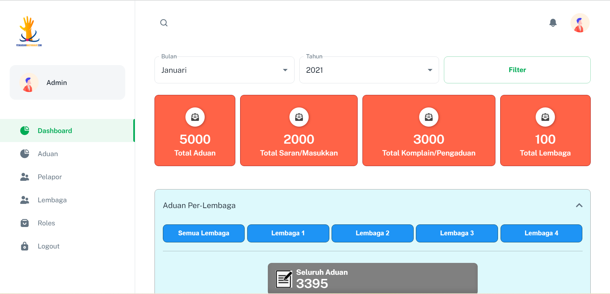

## Aduan with Minimal Library

[Minimal Library source](https://minimal-kit-react.vercel.app/)

> Dashboard Aduan and View List of Pengaduan

| [Minimal Free](https://minimal-kit-react.vercel.app/) | [Minimal](https://material-ui.com/store/items/minimal-dashboard/) |
| ----------------------------------------------------- | :---------------------------------------------------------------- |
| **7** Demo pages                                      |
| -                                                     |
| -                                                     | ✓ Dark/Light Mode 🌓                                              |
| -                                                     | ✓ Design files (Figma & Sketch)                                   |

## Page demo

- [Dashboard](https://minimal-kit-react.vercel.app/dashboard/app)
- [Users](https://minimal-kit-react.vercel.app/dashboard/user)
- [Login](https://minimal-kit-react.vercel.app/login)
- [Register](https://minimal-kit-react.vercel.app/register)
- [Not Found](https://minimal-kit-react.vercel.app/404)

## Getting started

- Recommended `node js 14+` and `npm 6+`
- Install dependencies: `npm install` or `yarn install`
- Start the server: `npm run start` or `yarn start`
